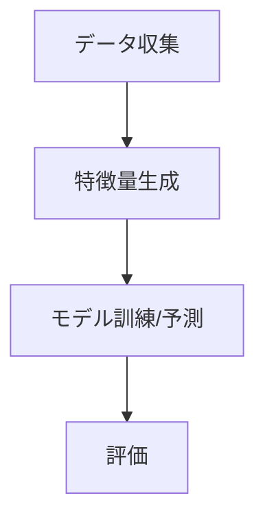

<!--
種別: ガイド
対象: 設計ドキュメント
作成日: 2026-03-16
更新日: 2026-03-16
担当: AIエージェント
-->

# 設計ドキュメント作成ガイド

## 1. 目的

本ガイドは fx-auto-trading の設計ドキュメント作成における指針を定める。

**対象読者**: 開発者、AIエージェント

**文書化の方針**:
- 設計書は「あるべき姿」を記述する。実装ステータスは記載しない
- コードの「なぜ」を記録し、「何」はコード自体に任せる
- 設計判断の背景と代替案を必ず残す

**実装ステータスに関する原則**:
- 禁止: 「未実装」「実装済み」「Phase N で対応」等の時間依存の記述
- 許可: 「スコープ外」「本モジュールでは扱わない」等の設計上の境界定義
- 許可: 「拡張ポイント」「代替案として検討可能」等の設計上の選択肢

## 2. ディレクトリ構成

```
design/
├── GUIDE.md              # 本ガイド
├── TEMPLATE.md           # 設計書テンプレート
├── decisions/            # ADR（アーキテクチャ決定記録）
├── modules/              # モジュール別設計書
└── flows/                # 処理フロー図（Mermaid）
```

## 3. 設計書の種類と役割

| 種類 | 格納先 | 目的 |
|------|--------|------|
| モジュール設計書 | `modules/` | モジュールの責務・インターフェース・内部構造を定義 |
| フロー図 | `flows/` | データフロー・処理シーケンスを可視化 |
| ADR | `decisions/` | アーキテクチャ判断の記録（選択肢・理由・トレードオフ） |

## 4. 種別ごとのセクション取捨選択表

| セクション | modules | flows | decisions |
|-----------|---------|-------|-----------|
| メタデータコメント | 必須 | 必須 | 必須 |
| 概要 | 必須 | 必須 | 必須 |
| 責務 | 必須 | - | - |
| インターフェース | 必須 | - | - |
| 内部構造 | 推奨 | - | - |
| Mermaid図 | 推奨 | 必須 | - |
| 設計判断 | - | - | 必須 |
| 関連ドキュメント | 必須 | 必須 | 必須 |

## 5. 記法規約

### コード参照形式

```
`src/fx_auto_trading/data/collector.py:GmoFxCollector.fetch_klines()`
```

### Mermaid図



### 相互参照

```markdown
- [技術スタックADR](./decisions/001-technology-stack.md)
```

## 6. AIエージェント向けルール

### 調査の深さ

設計書を作成する前に、以下を必ず確認する:
1. 対象モジュールのソースコードを全て読む
2. 関連する既存の設計書を確認する
3. 依存関係のあるモジュールのインターフェースを把握する

### 作成手順

1. TEMPLATE.md をベースにファイルを作成
2. メタデータコメントを記入
3. 各セクションを記述（空セクションは削除）
4. 関連ドキュメントのリンクを追加

## 7. テンプレートの使用方法

### ファイル命名規則

| 種類 | 形式 | 例 |
|------|------|-----|
| モジュール設計書 | `{module-name}.md` | `data-collector.md` |
| フロー図 | `{flow-name}.md` | `prediction-pipeline.md` |
| ADR | `{3桁番号}-{kebab-case}.md` | `001-technology-stack.md` |

## 8. 品質チェックリスト

- [ ] メタデータコメントが記入されている
- [ ] 空セクションがない
- [ ] コード参照が `file:function()` 形式になっている
- [ ] Mermaid図が正しくレンダリングされる
- [ ] 相互参照の相対パスが正しい
- [ ] 実装ステータスが混入していない

## 9. 参考資料

- [DOCS_PATTERN.md](../../.claude/skills/init-project-docs/DOCS_PATTERN.md) — ドキュメント設計パターン

## 10. 更新履歴

| 日付 | 内容 |
|------|------|
| 2026-03-16 | 初版作成（プロジェクトリブート） |
