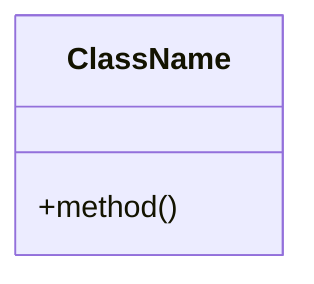
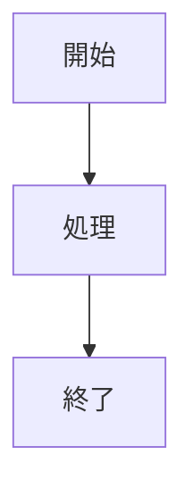

<!--
種別: {modules | flows | decisions}
対象: {対象名}
作成日: {YYYY-MM-DD}
更新日: {YYYY-MM-DD}
担当: {担当者}
-->

# {タイトル}

## 概要

{1-3文でこのドキュメントの目的を記述}

## 責務

{modules の場合: このモジュールが担う責務を箇条書き}

- {責務1}
- {責務2}

## インターフェース

{modules の場合: 公開API・関数シグネチャ}

```python
class ClassName:
    def method_name(self, param: Type) -> ReturnType:
        """説明"""
```

## 内部構造

{modules の場合: クラス図・データ構造}



## フロー

{flows の場合: Mermaid図で処理フローを記述}



## 設計判断

{decisions の場合: ADRテンプレートの形式に従う}

### 判断N: {カテゴリ} — {選択}

**問題**: {何を決定するか}
**選択肢**: 1. ... 2. ... 3. ...
**決定**: {選択肢N}
**理由**: ...
**トレードオフ**: 利点 / 欠点

## 関連ドキュメント

- [{関連ドキュメント名}]({相対パス})
